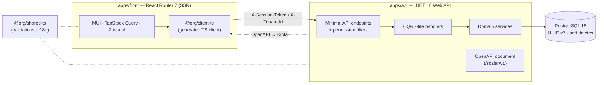
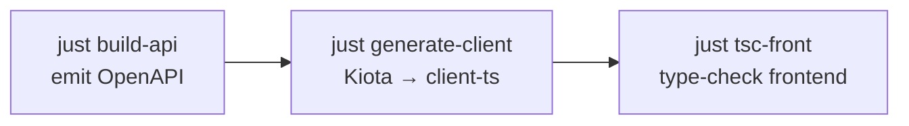

<!-- markdownlint-disable MD013 MD033 MD041 -->
<!-- Hero uses centered GitHub-supported HTML and opens with the brand mark by design. -->
<p align="center">
  
</p>

<h1 align="center">PublyApp</h1>

<p align="center">
  <strong>The multi-tenant SaaS foundation for operating content across many brands and projects — built as a type-safe full-stack monorepo.</strong>
  <br />
  Designed for teams building social scheduling and publishing workflows, with platform-grade tenancy, permission-driven access, and an end-to-end type-safe API contract.
</p>

<p align="center">
  <a href="https://dotnet.microsoft.com/"></a>
  <a href="https://react.dev/"></a>
  <a href="https://reactrouter.com/"></a>
  <a href="https://www.postgresql.org/"></a>
  <a href="https://pnpm.io/"></a>
  <a href="https://turbo.build/repo"></a>
</p>

<p align="center">
  
  <a href="#api-contract-workflow"></a>
  <a href="AGENTS.md"></a>
</p>

<p align="center">
  <a href="#quick-start">Quick Start</a> ·
  <a href="#architecture">Architecture</a> ·
  <a href="#api-contract-workflow">API Contract</a> ·
  <a href="#for-contributors-and-ai-agents">For Contributors &amp; AI Agents</a> ·
  <a href="#deployment">Deployment</a>
</p>
<!-- markdownlint-enable MD013 MD033 MD041 -->

---

## What is PublyApp?

<!-- markdownlint-disable MD013 MD060 -->

PublyApp is a full-stack SaaS foundation for **multi-tenant social content operations** across many
organizations. It ships as one monorepo — a .NET API, an SSR-capable React frontend, and a
TypeScript client generated from the API contract that keeps both sides in lockstep.

It is **multi-tenant from the ground up**, with three nested user scopes:

| Scope       | Who                       | What they operate on                                            |
| ----------- | ------------------------- | --------------------------------------------------------------- |
| **Staff**   | Platform administrators   | Every tenant, cross-org administration, support tooling         |
| **Tenant**  | Organization-level users  | Their organization's users, settings, and content               |
| **Project** | Project-level users       | A single workspace boundary for project-level operations         |

A `User` belongs to exactly **one** scope type — Staff and Tenant/Project accounts are mutually
exclusive — which keeps the security boundary unambiguous across the whole system.

<!-- markdownlint-enable MD013 MD060 -->

---

## Capabilities

<!-- markdownlint-disable MD013 MD060 -->

| | |
| --- | --- |
| **Multi-tenancy** — three nested scopes (Staff / Tenant / Project) with strict tenant isolation enforced across every request. | **Auth & permissions** — session-based authentication with route-level permission enforcement, not scattered ad-hoc checks. |
| **Project workspaces** — project-level boundaries for future content operations without weakening tenant isolation. | **Staff / admin tooling** — cross-tenant administration and support, cleanly separated from tenant-facing surfaces. |
| **User, profile & invitation flows** — account, profile, permission, and onboarding surfaces for operating tenant teams. | **Audit-ready operations** — audit logs and system notices make platform administration observable and supportable. |
| **Type-safe API contract** — the TypeScript client is generated from the API's OpenAPI document via Kiota and is never hand-edited. | **Production-ready data layer** — PostgreSQL 18 with UUID v7 keys, soft deletes, audit timestamps, and EF Core migrations. |

### Why it's built this way

- **End-to-end type safety** — a backend contract change surfaces as a TypeScript error, not a runtime surprise.
- **Vertical-slice, domain-first backend** — features live together (entities, services, handlers, endpoints) instead of being scattered across technical layers.
- **One toolchain, one repo** — Turborepo + pnpm workspaces unify backend, frontend, shared code, and the generated client.

<!-- markdownlint-enable MD013 MD060 -->

---

## Architecture

<!-- markdownlint-disable MD013 MD060 -->



**Request lifecycle.** A request flows through clear, enforced boundaries:

| Stage | Responsibility |
| --- | --- |
| `@org/client-ts` (generated) | Type-safe calls from the React app; sends `X-Session-Token` / `X-Tenant-Id`. |
| Minimal-API endpoints + permission filters | Route mapping and route-level permission enforcement. |
| CQRS-lite handlers | Orchestrate one operation each (create / find / get / update / delete). |
| Domain services | Business logic and data access (the only layer touching the DB). |
| PostgreSQL 18 | UUID v7 keys, soft deletes, audit timestamps. |

Shared validation and i18n live in `@org/shared-ts` and are consumed by both sides; the TypeScript
client is regenerated from the API's OpenAPI document via **Microsoft Kiota** (see
[API Contract Workflow](#api-contract-workflow)).

> **Technical trust:** vertical-slice / domain-first backend · RFC 7807 problem responses · permission-driven access · strict tenant isolation.

<!-- markdownlint-enable MD013 MD060 -->

---

## Tech Stack

<!-- markdownlint-disable MD013 MD060 -->

| Layer            | Technology                                                                       |
| ---------------- | -------------------------------------------------------------------------------- |
| **Backend**      | .NET 10.0 (ASP.NET Core Minimal APIs), EF Core, FluentValidation, Serilog, Polly |
| **Database**     | PostgreSQL 18 (UUID v7 PKs, soft deletes, audit timestamps)                      |
| **Frontend**     | React 19, React Router 7 (SSR), TypeScript, Vite                                 |
| **UI**           | MUI 7, Emotion, MUI X (Data Grid / Date Pickers), TipTap, Framer Motion          |
| **Client state** | TanStack Query (server), Zustand (global), nuqs (URL), React Hook Form + Zod     |
| **API contract** | OpenAPI + Scalar docs, Microsoft Kiota → generated TypeScript client             |
| **Monorepo**     | Turborepo, pnpm workspaces                                                        |
| **Quality**      | oxlint + oxfmt, custom Roslyn analyzers + ESLint rules, Husky, Knip              |
| **Deployment**   | Docker, GHCR, Dokploy on a Hostinger VPS, Traefik (SSL)                          |

<!-- markdownlint-enable MD013 MD060 -->

---

## API Contract Workflow

<!-- markdownlint-disable MD013 MD060 -->

The frontend client is **generated from the backend's OpenAPI document** — it is the signature
workflow of this repo. After any change that affects the API contract (DTOs, endpoints, validation),
run the three steps below in order:



1. **`just build-api`** — builds the .NET API and emits the OpenAPI document (the contract).
2. **`just generate-client`** — runs Microsoft Kiota to regenerate the TypeScript client in `packages/client-ts`.
3. **`just tsc-front`** — type-checks the frontend so any contract drift surfaces as a compile error, not a runtime bug.

```bash
just build-api        # build API + emit the OpenAPI document
just generate-client  # Kiota → regenerate packages/client-ts
just tsc-front        # confirm the frontend compiles against the new contract
```

> **Never hand-edit anything under `packages/client-ts/`.** It is overwritten on every generation —
> the OpenAPI document is the single source of truth for the client.

<!-- markdownlint-enable MD013 MD060 -->

---

## Quick Start

<!-- markdownlint-disable MD013 MD060 -->

> **Two ways in:** humans start here (run it locally); AI agents and contributors start at
> [For Contributors & AI Agents](#for-contributors-and-ai-agents).

### Prerequisites

- **Node.js** `>= 24` — manage with [fnm](https://github.com/Schniz/fnm) or [nvm](https://github.com/nvm-sh/nvm)
- **pnpm** `10.13.1` — `npm install -g pnpm@10.13.1` (or via [Corepack](https://nodejs.org/api/corepack.html))
- **.NET SDK** `10.0`
- **Docker** — runs PostgreSQL 18 locally (and the test database)
- **[just](https://github.com/casey/just)** — the task runner for this repo

> **Windows:** the `justfile` runs on PowerShell 7 (`pwsh`), not Windows PowerShell 5.1.

### Get running

```bash
# 1. Install everything (pnpm workspaces + dotnet restore + shared postinstall)
just install

# 2. Start PostgreSQL in Docker
just dev-db

# 3. Apply database migrations
just db-migrate

# 4. Start the API           (terminal 1)
just dev-api

# 5. Start the frontend       (terminal 2)
just dev-front
```

> First time? `just dev-setup` runs install + database in one step.

### Local URLs

| Service           | URL                                                            |
| ----------------- | ------------------------------------------------------------- |
| Frontend          | <http://localhost:5050>                                       |
| API               | <http://localhost:5000>                                       |
| API docs (Scalar) | <http://localhost:5000/scalar/v1>                             |
| PostgreSQL        | `localhost:5454`                                              |

Local development configuration lives in the committed `.env.development`, validated at startup.

<!-- markdownlint-enable MD013 MD060 -->

---

## Monorepo Map

<!-- markdownlint-disable MD013 MD060 -->

```text
publyapp/
├── apps/
│   ├── api/                # .NET 10 Web API — vertical-slice, domain-first modules
│   └── front/              # React Router 7 frontend (SSR-enabled)
├── packages/
│   ├── client-ts/          # @org/client-ts — generated TypeScript API client (Kiota) — do not edit
│   ├── shared-ts/          # @org/shared-ts — shared validations & i18n
│   ├── lint-ts/            # @org/lint-ts — custom ESLint/oxlint rules
│   ├── lint-cs/            # PublyApp.Analyzers — custom Roslyn analyzers
│   ├── scripts-cs/         # PublyApp.Scripts — codegen tooling (e.g. translation keys)
│   └── _tsconfig/          # Shared TypeScript configs
├── docs/guides/            # Canonical architecture & convention guides
├── justfile                # Task runner — see `just --list`
├── turbo.json              # Turborepo pipeline
└── docker-compose.services.yml # Local PostgreSQL service definition
```

<!-- markdownlint-enable MD013 MD060 -->

---

## Common Commands

<!-- markdownlint-disable MD013 MD060 -->

The repo is driven by [`just`](https://github.com/casey/just). Run **`just --list`** for the full,
authoritative reference — the highlights:

| Command                  | What it does                                          |
| ------------------------ | ----------------------------------------------------- |
| `just install`           | Install all dependencies (pnpm + dotnet restore)      |
| `just dev-api`           | Run the API with hot reload (`dotnet watch`)          |
| `just dev-front`         | Run the frontend (Vite dev server)                    |
| `just dev-db`            | Start PostgreSQL in Docker                            |
| `just build-api`         | Build the .NET API                                    |
| `just build-front`       | Build the frontend for production                     |
| `just build-deploy`      | Build deployment artifacts                            |
| `just db-migrate`        | Apply EF Core migrations                              |
| `just db-add <Name>`     | Add a new migration                                   |
| `just db-reset`          | Drop and recreate the database                        |
| `just generate-client`   | Build API + regenerate the TypeScript client (Kiota)  |
| `just tsc-front`         | Type-check the frontend                               |
| `just check-write`       | Run oxlint + oxfmt with auto-fix                       |
| `just test-api`          | Run API integration tests (requires Docker)           |
| `just test-analyzers`    | Run the Roslyn analyzer tests                         |

<!-- markdownlint-enable MD013 MD060 -->

---

## Testing & Quality

<!-- markdownlint-disable MD013 MD060 -->

```bash
just test-api          # API integration tests (Testcontainers spins up Postgres — Docker required)
just test-analyzers    # Roslyn analyzer unit tests
just check-write       # oxlint + oxfmt (auto-fix)
just tsc-front         # frontend type checking
just knip              # find unused dependencies
```

Run a single API test class or method with a filter:

```bash
cd apps/api && dotnet test Tests/MainApi.Tests.csproj -c Test --filter "FullyQualifiedName~PasswordLoginSpec"
```

Quality gates also run automatically on commit via Husky. See
[`docs/guides/api-integration-tests.md`](docs/guides/api-integration-tests.md) and
[`docs/guides/test-conventions.md`](docs/guides/test-conventions.md) for the full guide.

<!-- markdownlint-enable MD013 MD060 -->

---

## For Contributors and AI Agents

<!-- markdownlint-disable MD013 MD060 -->

> **[`AGENTS.md`](AGENTS.md) is the single source of truth** for architecture, conventions, and
> coding standards in this repo. Read it before contributing — both humans and AI coding assistants
> are expected to follow it exactly. (`CLAUDE.md` simply points to it.)

- **Humans:** run it locally via [Quick Start](#quick-start).
- **AI agents & contributors:** read [`AGENTS.md`](AGENTS.md) first, then the grouped guides below.

`AGENTS.md` links out to focused guides under [`docs/guides/`](docs/guides), including:

- **Backend** — [api-module-structure](docs/guides/api-module-structure.md),
  [api-route-design](docs/guides/api-route-design.md),
  [csharp-coding-standards](docs/guides/csharp-coding-standards.md),
  [architecture-details](docs/guides/architecture-details.md)
- **Frontend** — [frontend-architecture](docs/guides/frontend-architecture.md),
  [frontend-coding-standards](docs/guides/frontend-coding-standards.md),
  [frontend-error-handling](docs/guides/frontend-error-handling.md),
  [error-views](docs/guides/error-views.md)
- **Contracts & workflows** — [openapi-kiota-safeguards](docs/guides/openapi-kiota-safeguards.md),
  [common-workflows](docs/guides/common-workflows.md),
  [project-conventions](docs/guides/project-conventions.md)

A few non-negotiables worth surfacing here:

- Frontend uses **MUI components and the `sx` prop only** — no native HTML elements, no Tailwind.
- Backend errors are **RFC 7807** (`application/problem+json`); `401` means "session invalid" only.
- Add new backend code under domain modules in `apps/api/Modules/<Domain>/` — not the legacy folders.
- Regenerate, never hand-edit, the API client (see [API Contract Workflow](#api-contract-workflow)).

<!-- markdownlint-enable MD013 MD060 -->

---

## Deployment

<!-- markdownlint-disable MD013 MD060 -->

PublyApp deploys to **Dokploy on a Hostinger VPS**: GitHub → GHCR Docker images → Dokploy → Traefik
(SSL termination). Deployment configuration lives in `dokploy.yml`; build artifacts are produced with
`just build-deploy`. See [`docs/misc/deployment-guide.md`](docs/misc/deployment-guide.md) for details.

<!-- markdownlint-enable MD013 MD060 -->

---

## Status & License

<!-- markdownlint-disable MD013 MD060 -->

**Status:** Active development. **License:** Proprietary — all rights reserved. This repository is not
licensed for redistribution or use outside the PublyApp project.
<!-- markdownlint-enable MD013 MD060 -->
