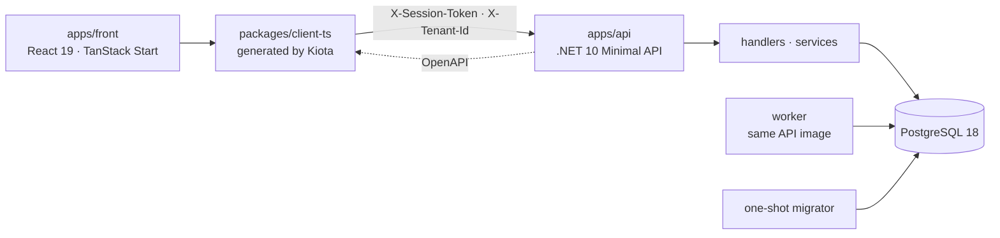

<!-- markdownlint-disable MD013 MD033 MD041 -->
<p align="center">
  
</p>

<h1 align="center">PublyApp</h1>

<p align="center">
  <strong>An open-core foundation for multi-tenant social-content operations.</strong>
  <br />
  One type-safe monorepo for platform administration, tenant workspaces, and the workflows around social content.
</p>

<p align="center">
  <a href="LICENSE"></a>
  <a href="https://dotnet.microsoft.com/"></a>
  <a href="https://react.dev/"></a>
  <a href="https://www.postgresql.org/"></a>
</p>

<p align="center">
  <a href="#what-ships-today">What ships</a> ·
  <a href="#quick-start">Quick start</a> ·
  <a href="#architecture-at-a-glance">Architecture</a> ·
  <a href="#contributing">Contributing</a> ·
  <a href="#licence-and-open-core-boundary">Licence</a>
</p>
<!-- markdownlint-enable MD013 MD033 MD041 -->

## What is PublyApp?

PublyApp is a full-stack SaaS foundation for teams operating across multiple
organizations and projects. The repository combines a .NET 10 API, a React 19
frontend built with TanStack Start, PostgreSQL, background jobs, database
migrations, and a TypeScript client generated from the API's OpenAPI contract.

The platform has three distinct operating scopes:

| Scope | Purpose |
| --- | --- |
| **Staff** | Platform-wide administration and support across tenants. |
| **Tenant** | Organization-level users, settings, and operations. |
| **Project** | A workspace boundary inside a tenant. |

Staff and tenant/project accounts are mutually exclusive. This keeps the
platform-administration boundary separate from tenant data and permissions.

## What ships today

- Multi-tenant request handling with explicit tenant isolation.
- Session authentication and route-level permission enforcement.
- Staff, tenant, and project account boundaries.
- User, profile, permission, and invitation workflows.
- Post drafting, scheduling, publish-now actions, and publication history.
- Social-account connections and a Bluesky publishing provider.
- Audit logs and system notices for observable administration.
- RFC 7807 error contracts and an OpenAPI-generated Kiota client.
- A deployable API, background worker, database migrator, and frontend.

### Product direction

PublyApp already carries the core post and publishing pipeline. The product
direction is to turn it into a complete multi-network workspace, with richer
calendar, queue, planning, and review experiences. Those end-to-end product
surfaces remain active development areas; partial workflows are not presented
as complete.

## Quick start

### Prerequisites

- Node.js 24 or newer
- pnpm 10.13.1
- .NET SDK 10
- Docker
- [`just`](https://github.com/casey/just)

On Windows, the `justfile` requires PowerShell 7 (`pwsh`).

### Start the full local stack

```bash
cp .env.example .env.development
just install
just dev-db
```

`just dev-db` stays attached and starts persistent PostgreSQL, the API, the
worker, and the frontend. In a second terminal, apply migrations:

```bash
just db-migrate
```

| Service | Local address |
| --- | --- |
| Frontend | <http://localhost:5050> |
| API | <http://localhost:5000> |
| API reference (Scalar) | <http://localhost:5000/scalar/v1> |
| PostgreSQL | `localhost:5454` |

Do not start `just dev-api` alongside `just dev-db`; the AppHost already owns
port 5000. For the split-terminal alternative and environment rules, read the
[development commands in `AGENTS.md`](AGENTS.md#development-commands).

## Architecture at a glance



The backend uses domain-first vertical slices: endpoints map routes and
permissions, handlers orchestrate an operation, and domain services own
business logic and data access. Authenticated frontend data stays client-side
and flows through TanStack Query and the generated API client.

```text
apps/
├── api/          # API, worker runtime, and migrator source
└── front/        # shipped TanStack Start frontend
packages/
├── client-ts/    # generated API client; never edit by hand
├── shared-ts/    # shared validation, types, and i18n
├── lint-ts/      # custom TypeScript lint rules
├── lint-cs/      # custom Roslyn analyzers
└── scripts-cs/   # .NET code-generation tools
```

Read the focused guides for the full rules:

- [Backend module structure](docs/guides/api-module-structure.md)
- [API route design](docs/guides/api-route-design.md)
- [Frontend architecture and commands](docs/guides/front/index.md)
- [Frontend conventions](docs/guides/front/conventions.md)
- [Architecture details](docs/guides/architecture-details.md)

## API contract workflow

The TypeScript client is generated from the backend's OpenAPI document. After
changing an endpoint or wire contract, regenerate and type-check it:

```bash
just build-api
just generate-client
pnpm --filter front typecheck
```

Never hand-edit `packages/client-ts`; regeneration replaces its contents.

## Development and quality

The repository uses `just` for its supported workflows. `just --list` is the
full command reference; these are the common entry points:

| Command | Purpose |
| --- | --- |
| `just dev-db` | Run the complete local stack. |
| `just build-api` | Build the API and emit OpenAPI. |
| `pnpm --filter front build` | Build the shipped frontend. |
| `just test-api` | Run API integration tests with Testcontainers. |
| `pnpm --filter front test` | Run frontend tests and their existing guards. |
| `just check-write` | Apply lint and formatting fixes. |
| `just ci` | Run the local pre-push gate, including the API suite. |
| `just ci-full` | Add both end-to-end suites to the pre-push gate. |

GitHub Actions also runs the API, frontend, contract, documentation, and
security gates required for pull requests. See the
[local CI guide](docs/guides/local-ci-gate.md) for the exact local/hosted
mapping and known gaps.

## Contributing

Start with [`CONTRIBUTING.md`](CONTRIBUTING.md), then read [`AGENTS.md`](AGENTS.md),
the source of truth for this repository's architecture and coding conventions.
The latter applies to both human contributors and coding agents.

Contributors sign the [`CLA`](CLA.md) once by adding themselves to
[`CLA-SIGNATURES.md`](CLA-SIGNATURES.md) and including the acceptance statement
described in the agreement.

Useful rules to know before opening a pull request:

- Frontend work belongs in `apps/front`; the retired frontend is not in this tree.
- New backend slices belong under `apps/api/Modules/<Domain>/`.
- API errors use RFC 7807, and only an invalid or missing session returns `401`.
- Generated client files are outputs, not hand-edited source.
- Run the checks appropriate to the changed surface before pushing.

## Deployment

The repository publishes three release images — `api`, `migrate`, and `front`.
The declared Dokploy topology runs four services: API, worker (from the API
image), one-shot migrator, and frontend. All release images share one immutable
commit tag.

Operational details live in the maintained deployment documents:

- [Production deployment design](docs/deployment/production-deployment-design.md)
- [Production deployment runbook](docs/deployment/production-deploy-runbook.md)
- [First-deploy runbook](docs/deployment/first-deploy-runbook.md)

## Licence and open-core boundary

The source in this repository is licensed under the
[Apache License 2.0](LICENSE). See [`NOTICE`](NOTICE) for attribution and the
repository scope.

PublyApp uses an open-core model. Paid modules distributed separately as
closed-source binaries are not part of this repository and are not covered by
its Apache-2.0 licence. Contributions to this repository are governed by the
[`CLA`](CLA.md), under which contributors keep their copyright while granting
the project the rights described there.
