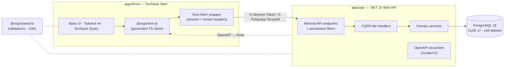
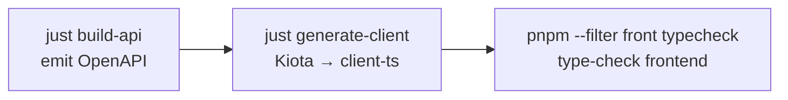

<!-- markdownlint-disable MD013 MD033 MD041 -->
<!-- Hero uses centered GitHub-supported HTML and opens with the brand mark by design. -->
<p align="center">
  
</p>

<h1 align="center">PublyApp</h1>

<p align="center">
  <strong>The multi-tenant SaaS foundation for operating content across many brands and projects — built as a type-safe full-stack monorepo.</strong>
  <br />
  Designed for teams building social scheduling and publishing workflows, with platform-grade tenancy, permission-driven access, and an end-to-end type-safe API contract.
</p>

<p align="center">
  <a href="https://dotnet.microsoft.com/"></a>
  <a href="https://react.dev/"></a>
  <a href="https://tanstack.com/start"></a>
  <a href="https://tailwindcss.com/"></a>
  <a href="https://www.postgresql.org/"></a>
  <a href="https://pnpm.io/"></a>
  <a href="https://turbo.build/repo"></a>
</p>

<p align="center">
  
  <a href="#api-contract-workflow"></a>
  <a href="AGENTS.md"></a>
</p>

<p align="center">
  <a href="#quick-start">Quick Start</a> ·
  <a href="#architecture">Architecture</a> ·
  <a href="#api-contract-workflow">API Contract</a> ·
  <a href="#for-contributors-and-ai-agents">For Contributors &amp; AI Agents</a> ·
  <a href="#deployment">Deployment</a>
</p>
<!-- markdownlint-enable MD013 MD033 MD041 -->

---

## What is PublyApp?

<!-- markdownlint-disable MD013 MD060 -->

PublyApp is a full-stack SaaS foundation for **multi-tenant social content operations** across many
organizations. It ships as one monorepo — a .NET API (which also runs as a background worker and a
migrator), a TanStack Start React frontend (`apps/front`), and a TypeScript client generated from
the API contract that keeps both sides in lockstep.

It is **multi-tenant from the ground up**, with three nested user scopes:

| Scope       | Who                       | What they operate on                                            |
| ----------- | ------------------------- | --------------------------------------------------------------- |
| **Staff**   | Platform administrators   | Every tenant, cross-org administration, support tooling         |
| **Tenant**  | Organization-level users  | Their organization's users, settings, and content               |
| **Project** | Project-level users       | A single workspace boundary for project-level operations         |

A `User` belongs to exactly **one** scope type — Staff and Tenant/Project accounts are mutually
exclusive — which keeps the security boundary unambiguous across the whole system.

<!-- markdownlint-enable MD013 MD060 -->

---

## Capabilities

<!-- markdownlint-disable MD013 MD060 -->

| | |
| --- | --- |
| **Multi-tenancy** — three nested scopes (Staff / Tenant / Project) with strict tenant isolation enforced across every request. | **Auth & permissions** — session-based authentication with route-level permission enforcement, not scattered ad-hoc checks. |
| **Project workspaces** — project-level boundaries for future content operations without weakening tenant isolation. | **Staff / admin tooling** — cross-tenant administration and support, cleanly separated from tenant-facing surfaces. |
| **User, profile & invitation flows** — account, profile, permission, and onboarding surfaces for operating tenant teams. | **Audit-ready operations** — audit logs and system notices make platform administration observable and supportable. |
| **Type-safe API contract** — the TypeScript client is generated from the API's OpenAPI document via Kiota and is never hand-edited. | **Production-ready data layer** — PostgreSQL 18 with UUID v7 keys, soft deletes, audit timestamps, and EF Core migrations. |

### Why it's built this way

- **End-to-end type safety** — a backend contract change surfaces as a TypeScript error, not a runtime surprise.
- **Vertical-slice, domain-first backend** — features live together (entities, services, handlers, endpoints) instead of being scattered across technical layers.
- **One toolchain, one repo** — Turborepo + pnpm workspaces unify backend, frontend, shared code, and the generated client.

<!-- markdownlint-enable MD013 MD060 -->

---

## Architecture

<!-- markdownlint-disable MD013 MD060 -->



**Request lifecycle.** A request flows through clear, enforced boundaries:

| Stage | Responsibility |
| --- | --- |
| `@org/client-ts` (generated) | Type-safe request builders generated from OpenAPI. |
| `apps/front` fetch wrapper | Sends the request and injects `X-Session-Token` / `X-PublyApp-TenantId` for same-origin API calls. |
| Minimal-API endpoints + permission filters | Route mapping and route-level permission enforcement. |
| CQRS-lite handlers | Orchestrate one operation each (create / find / get / update / delete). |
| Domain services | Business logic and data access (the only layer touching the DB). |
| PostgreSQL 18 | UUID v7 keys, soft deletes, audit timestamps. |

Shared validation and i18n live in `@org/shared-ts` and are consumed by both sides; the TypeScript
client is regenerated from the API's OpenAPI document via **Microsoft Kiota** (see
[API Contract Workflow](#api-contract-workflow)).

> **Technical trust:** vertical-slice / domain-first backend · RFC 7807 problem responses · permission-driven access · strict tenant isolation.

<!-- markdownlint-enable MD013 MD060 -->

---

## Tech Stack

<!-- markdownlint-disable MD013 MD060 -->

| Layer            | Technology                                                                       |
| ---------------- | -------------------------------------------------------------------------------- |
| **Backend**      | .NET 10.0 (ASP.NET Core Minimal APIs), EF Core, FluentValidation, Serilog, Polly |
| **Database**     | PostgreSQL 18 (UUID v7 PKs, soft deletes, audit timestamps)                      |
| **Frontend**     | React 19, TanStack Start + TanStack Router, TypeScript, Vite                      |
| **UI**           | `@base-ui/react` primitives behind a local `components/ui/*` layer, Tailwind v4   |
| **Client state** | TanStack Query (server), Zustand (UI), TanStack Router search params (URL), React Hook Form + Zod |
| **API contract** | OpenAPI + Scalar docs, Microsoft Kiota → generated TypeScript client             |
| **Monorepo**     | Turborepo, pnpm workspaces                                                        |
| **Quality**      | oxlint + oxfmt, custom Roslyn analyzers + ESLint rules, Husky, Knip              |
| **Deployment**   | Docker, GHCR, Dokploy on a Hostinger VPS, Traefik (SSL)                          |

<!-- markdownlint-enable MD013 MD060 -->

---

## API Contract Workflow

<!-- markdownlint-disable MD013 MD060 -->

The frontend client is **generated from the backend's OpenAPI document** — it is the signature
workflow of this repo. After any change that affects the API contract (DTOs, endpoints, validation),
run the three steps below in order:



1. **`just build-api`** — builds the .NET API and emits the OpenAPI document (the contract).
2. **`just generate-client`** — runs Microsoft Kiota to regenerate the TypeScript client in `packages/client-ts`.
3. **`pnpm --filter front typecheck`** — type-checks the frontend so any contract drift surfaces as a compile error, not a runtime bug.

```bash
just build-api                     # build API + emit the OpenAPI document
just generate-client               # Kiota → regenerate packages/client-ts
pnpm --filter front typecheck      # confirm the frontend compiles against the new contract
```

> **Never hand-edit anything under `packages/client-ts/`.** It is overwritten on every generation —
> the OpenAPI document is the single source of truth for the client.

<!-- markdownlint-enable MD013 MD060 -->

---

## Quick Start

<!-- markdownlint-disable MD013 MD060 -->

> **Two ways in:** humans start here (run it locally); AI agents and contributors start at
> [For Contributors & AI Agents](#for-contributors-and-ai-agents).

### Prerequisites

- **Node.js** `>= 24` — manage with [fnm](https://github.com/Schniz/fnm) or [nvm](https://github.com/nvm-sh/nvm)
- **pnpm** `10.13.1` — `npm install -g pnpm@10.13.1` (or via [Corepack](https://nodejs.org/api/corepack.html))
- **.NET SDK** `10.0`
- **Docker** — runs PostgreSQL 18 locally (and the test database)
- **[just](https://github.com/casey/just)** — the task runner for this repo

> **Windows:** the `justfile` runs on PowerShell 7 (`pwsh`), not Windows PowerShell 5.1.

### Get running

```bash
# 1. Create local configuration
cp .env.example .env.development

# 2. Install everything (pnpm workspaces + dotnet restore + shared postinstall)
just install

# 3. Start the full local stack: the Aspire AppHost runs a persistent Postgres
#    (host port 5454, named data volume), the API (5000), the worker, and the
#    front dev server.
just dev-db

# 4. Apply database migrations
just db-migrate
```

Alternative without the AppHost — one terminal each: `just dev-api-migrated`
(migrations + API, port 5000) and `just dev-front` (port 5050). Do NOT run
`just dev-api` alongside `just dev-db`: both would bind port 5000.

The copied template already targets the local AppHost database (port 5454). Keep its local development values
unless you intentionally run a different local database.

> Use `pnpm --filter front <script>` or `just ci-front` for the frontend. `apps/old-front` was retired on 2026-08-22 (tag `old-front-final`).

> After creating and editing `.env.development`, `just dev-setup` can run install + the
> AppHost in one step.

### Local URLs

| Service           | URL                                                            |
| ----------------- | ------------------------------------------------------------- |
| Frontend          | <http://localhost:5050>                                       |
| API               | <http://localhost:5000>                                       |
| API docs (Scalar) | <http://localhost:5000/scalar/v1>                             |
| PostgreSQL        | `localhost:5454`                                              |

Local development configuration lives in `.env.development`. It is the only env file the API loads,
and only when the host environment is Development or unset; the API throws at startup or during
build-time initialization when the file is required but absent. Deployed configuration comes from
the active PaaS configuration/secrets service (Dokploy today), never from an application-loaded
`.env` file. A local `.env.production` may be an ignored, manually imported personal reference, but
the application never loads it. Real env files must never be committed; `AppEnvironment` validates
the resulting runtime environment variables at startup.

<!-- markdownlint-enable MD013 MD060 -->

---

## Monorepo Map

<!-- markdownlint-disable MD013 MD060 -->

```text
publyapp/
├── apps/
│   ├── api/                # .NET 10 Web API — vertical-slice, domain-first modules.
│   │                       #   Also the background worker (APP_ROLE=worker) and the migrator.
│   └── front/              # THE frontend — TanStack Start + Base UI + Tailwind v4 (deployed)
├── packages/
│   ├── client-ts/          # @org/client-ts — generated TypeScript API client (Kiota) — do not edit
│   ├── shared-ts/          # @org/shared-ts — shared validations & i18n
│   ├── lint-ts/            # @org/lint-ts — custom ESLint/oxlint rules
│   ├── lint-cs/            # PublyApp.Analyzers — custom Roslyn analyzers
│   ├── scripts-cs/         # PublyApp.Scripts — codegen tooling (e.g. translation keys)
│   └── _tsconfig/          # Shared TypeScript configs
├── docs/guides/            # Canonical architecture & convention guides
├── justfile                # Task runner — see `just --list`
├── turbo.json              # Turborepo pipeline
└── apps/apphost/            # Aspire AppHost — local dev orchestration (postgres + api + worker + front)
```

<!-- markdownlint-enable MD013 MD060 -->

---

## Common Commands

<!-- markdownlint-disable MD013 MD060 -->

The repo is driven by [`just`](https://github.com/casey/just). Run **`just --list`** for the full,
authoritative reference — the highlights:

| Command                  | What it does                                          |
| ------------------------ | ----------------------------------------------------- |
| `just install`           | Install all dependencies (pnpm + dotnet restore)      |
| `just dev-api`           | Run the API with hot reload (`dotnet watch`)          |
| `pnpm --filter front dev` | Run the frontend (TanStack Start dev server)       |
| `just dev-db`            | Start the Aspire AppHost (postgres + api + worker + front) |
| `just build-api`         | Build the .NET API                                    |
| `pnpm --filter front build` | Build the frontend for production                |
| `just db-migrate`        | Apply EF Core migrations                              |
| `just db-add <Name>`     | Add a new migration                                   |
| `just db-reset`          | Drop and recreate the database                        |
| `just generate-client`   | Build API + regenerate the TypeScript client (Kiota)  |
| `pnpm --filter front typecheck` | Type-check the frontend                     |
| `just check-write`       | Run oxlint + oxfmt with auto-fix                       |
| `just test-api`          | Run API integration tests (requires Docker)           |
| `pnpm --filter front test` | Run the frontend suite + its design-system guards |
| `just ci-front`        | The frontend CI gate (build, bundle guards, smoke, typecheck, tests) |
| `just test-analyzers`    | Run the Roslyn analyzer tests                         |
| `just ci`                | Full local pre-push gate — mirrors CI + API suite (Docker required) |
| `just deploy-images`     | Build + push GHCR deploy images from a clean checkout of a ref |

<!-- markdownlint-enable MD013 MD060 -->

---

## Testing & Quality

<!-- markdownlint-disable MD013 MD060 -->

```bash
just test-api                      # API integration tests (Testcontainers spins up Postgres — Docker required)
just test-analyzers                # Roslyn analyzer unit tests
pnpm --filter front test           # frontend unit/component suite + design-system guards
pnpm --filter front typecheck      # frontend type checking
just check-write                   # oxlint + oxfmt (auto-fix)
just knip                          # find unused dependencies

just ci                # Full pre-push gate: mirrors CI + runs the full API suite (Docker required)
just ci-full           # just ci plus both end-to-end browser suites
```

**`just ci` is the everyday pre-push gate** — run it before pushing. It actually covers *more* than
the GitHub workflow did: the online CI never ran the API suite, so the local gate is the stronger
backend signal. Full details, exemptions, and known gaps:
[`docs/guides/local-ci-gate.md`](docs/guides/local-ci-gate.md).

Run a single API test class or method with a filter:

```bash
cd apps/api && dotnet test Tests/PublyApp.Api.Tests.csproj -c Test --filter "FullyQualifiedName~PasswordLoginSpec"
```

Quality gates also run automatically on commit via Husky. See
[`docs/guides/api-integration-tests.md`](docs/guides/api-integration-tests.md) and
[`docs/guides/test-conventions.md`](docs/guides/test-conventions.md) for the full guide.

<!-- markdownlint-enable MD013 MD060 -->

---

## For Contributors and AI Agents

<!-- markdownlint-disable MD013 MD060 -->

> **[`AGENTS.md`](AGENTS.md) is the single source of truth** for architecture, conventions, and
> coding standards in this repo. Read it before contributing — both humans and AI coding assistants
> are expected to follow it exactly. (`CLAUDE.md` simply points to it.)

- **Humans:** run it locally via [Quick Start](#quick-start).
- **AI agents & contributors:** read [`AGENTS.md`](AGENTS.md) first, then the grouped guides below.

`AGENTS.md` links out to focused guides under [`docs/guides/`](docs/guides), including:

- **Backend** — [api-module-structure](docs/guides/api-module-structure.md),
  [api-route-design](docs/guides/api-route-design.md),
  [csharp-coding-standards](docs/guides/csharp-coding-standards.md),
  [architecture-details](docs/guides/architecture-details.md)
- **Frontend (front)** — [front/index](docs/guides/front/index.md),
  [front/conventions](docs/guides/front/conventions.md),
  [frontend-error-handling](docs/guides/frontend-error-handling.md)
  (its `ApiFailure` contract is normative; its code examples were MUI-era `apps/old-front`, retired with the app)
- **Contracts & workflows** — [openapi-kiota-safeguards](docs/guides/openapi-kiota-safeguards.md),
  [common-workflows](docs/guides/common-workflows.md),
  [project-conventions](docs/guides/project-conventions.md)

A few non-negotiables worth surfacing here:

- Frontend work means **`apps/front`**: `@base-ui/react` primitives behind a local
  `components/ui/*` layer, styled with **Tailwind v4**. No MUI, no `sx`.
- **`apps/old-front` was retired on 2026-08-22** (tag `old-front-final`). It is not built, not deployed, and must not be edited or copied.
- Backend errors are **RFC 7807** (`application/problem+json`); `401` means "session invalid" only.
- Add new backend code under domain modules in `apps/api/Modules/<Domain>/` — not the legacy folders.
- Regenerate, never hand-edit, the API client (see [API Contract Workflow](#api-contract-workflow)).

<!-- markdownlint-enable MD013 MD060 -->

---

## Deployment

<!-- markdownlint-disable MD013 MD060 -->

The first-deploy operator record says PublyApp has been **live in production since 2026-07-20** on
**Dokploy on a Hostinger VPS**, with the live app observed in plain `docker compose` mode rather
than Swarm: GitHub → GHCR Docker images → Dokploy → Traefik (SSL termination). The repository
declares the service topology in `dokploy.yml` but does not encode the selected Dokploy mode.

A release publishes **three** images — `api`, `migrate`, and `front` — all tagged with the same
commit SHA. They back **four declared services**: the long-running `publyapp-api`,
`publyapp-worker` (the same API image with `APP_ROLE=worker`), and `publyapp-front`, plus the
one-shot `publyapp-migrate`, which exits and remains stopped after migrations finish.

**Publishing images:** deploy images normally build in CI
(`.github/workflows/deploy-images.yml`). When that workflow is unavailable, publish them locally
with **`just deploy-images [ref]`** (defaults to `origin/develop`) — it builds the same three images
from a clean checkout at that commit and prints the `RELEASE_TAG` to set in Dokploy → Environment
before redeploying. Run `docker login ghcr.io` first.

Operational docs live in [`docs/deployment/`](docs/deployment):
[production-deployment-design](docs/deployment/production-deployment-design.md) (why it is shaped
this way), [production-deploy-runbook](docs/deployment/production-deploy-runbook.md) (migration
gating and the release checklist), and
[first-deploy-runbook](docs/deployment/first-deploy-runbook.md) (click-by-click, plus the traps that
actually bit).

<!-- markdownlint-enable MD013 MD060 -->

---

## Status & License

<!-- markdownlint-disable MD013 MD060 -->

**Status:** Live in production (since 2026-07-20) and under active development. **License:**
Proprietary — all rights reserved. This repository is not
licensed for redistribution or use outside the PublyApp project.
<!-- markdownlint-enable MD013 MD060 -->
