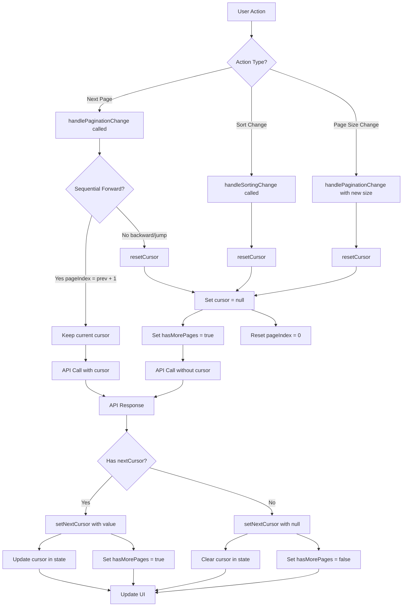
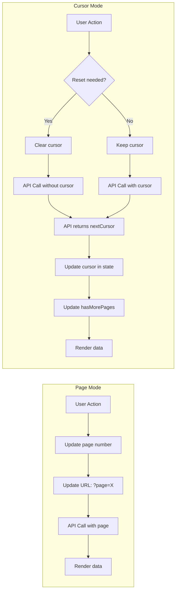
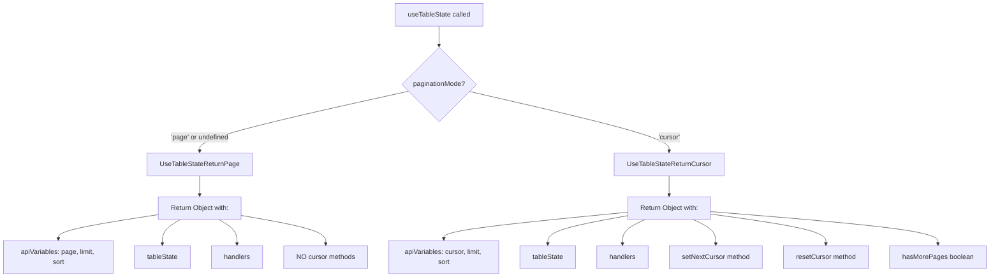
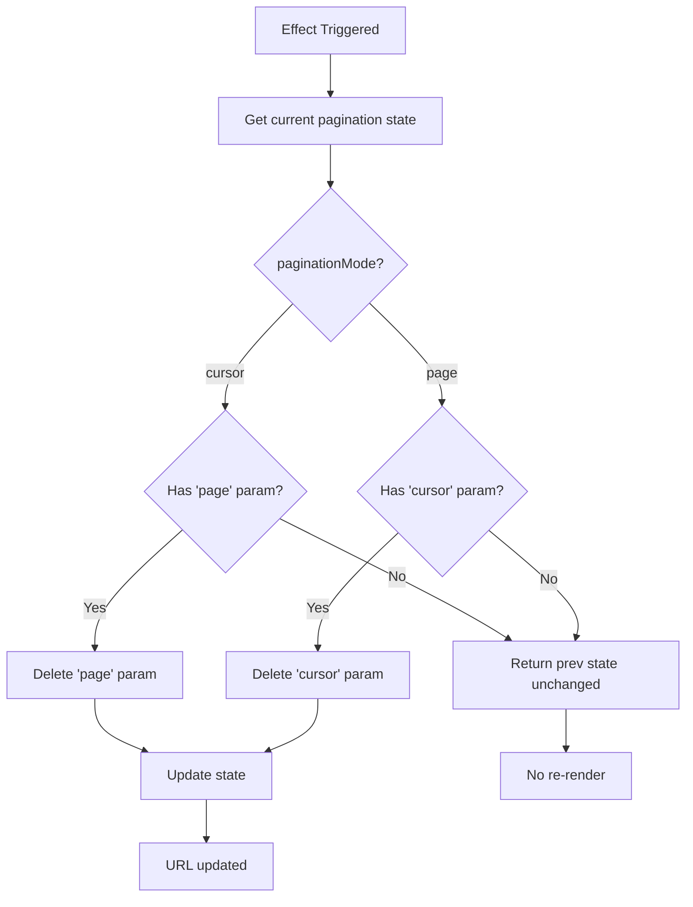
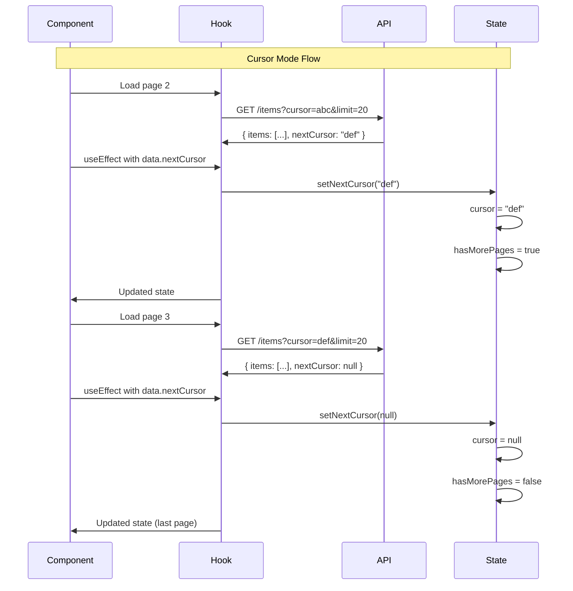
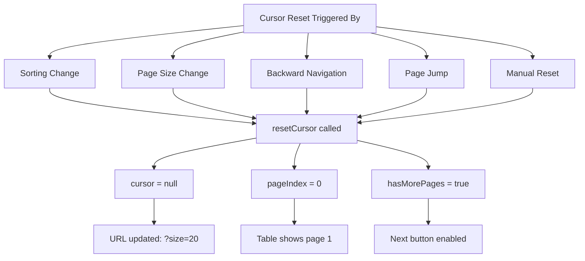
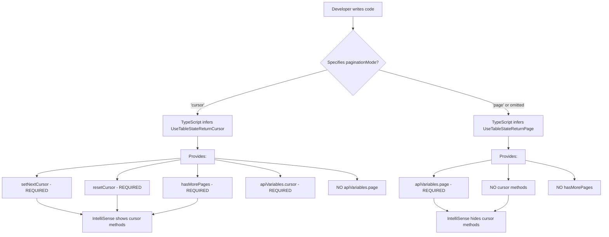
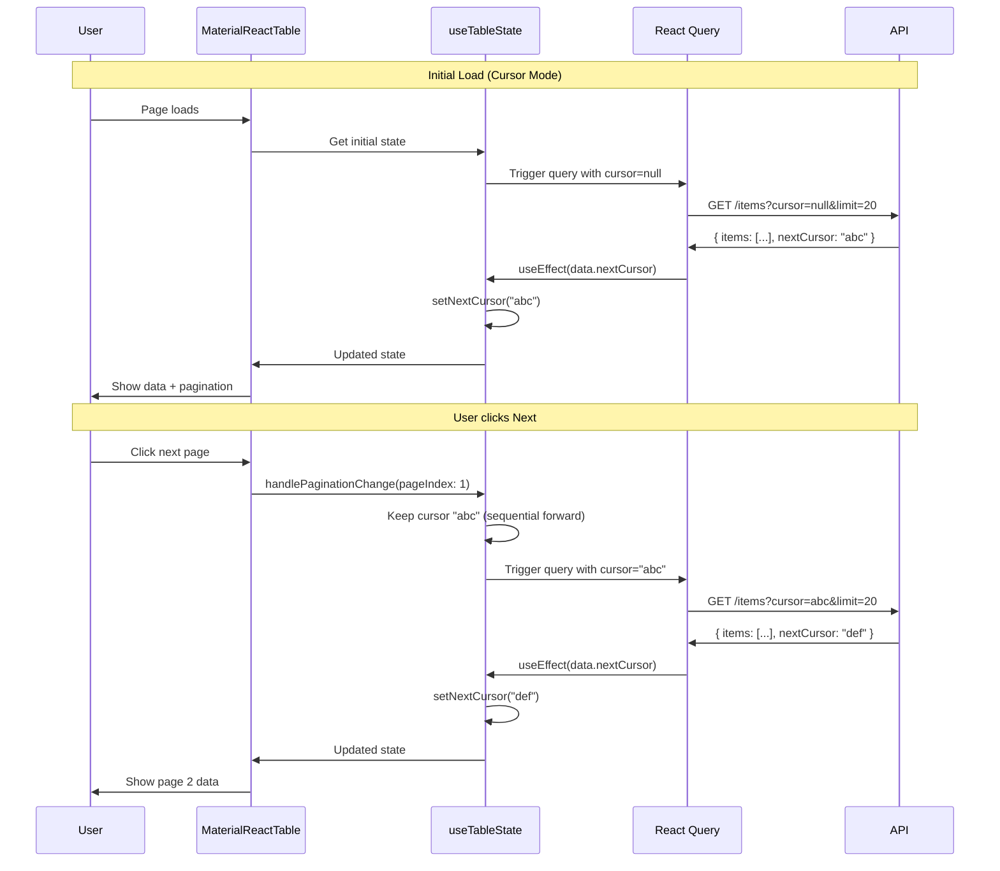
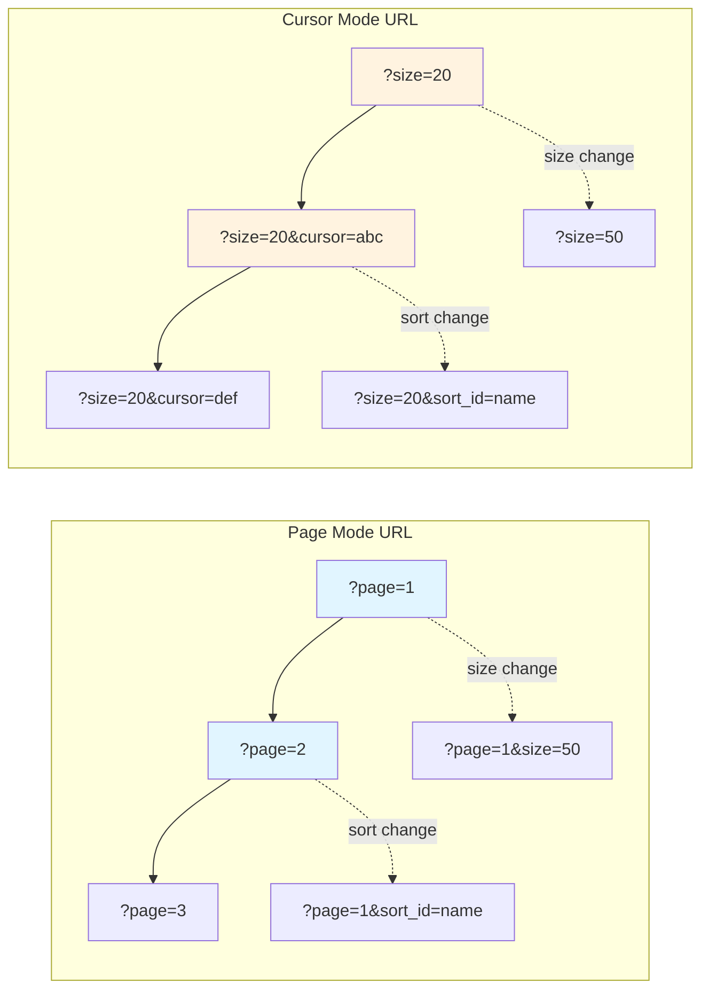
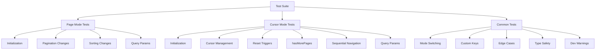

# Flow Diagrams

## Cursor Mode Pagination Flow

## Page Mode vs Cursor Mode State Management

## Hook Return Type Decision Tree

## Cleanup Effect Logic

## API Response Handling

## Cursor Reset Scenarios

## Type Safety Flow

## Component Integration Pattern

## URL State Management

## Testing Coverage Map

