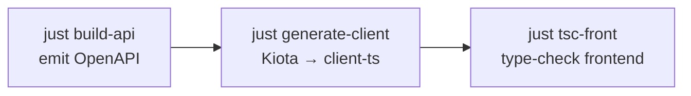

# README Premium Glow-Up Implementation Plan

> **For agentic workers:** REQUIRED SUB-SKILL: Use superpowers:subagent-driven-development (recommended) or superpowers:executing-plans to implement this plan task-by-task. Steps use checkbox (`- [ ]`) syntax for tracking.

**Goal:** Rewrite `README.md` into a premium, GitHub-ready product-and-architecture portal (direction A + C hybrid) that stays 100% accurate to the repo and keeps the proprietary tone.

**Architecture:** This is a documentation task. There is no code under test, so TDD is adapted into **documentation verification**: each task first establishes a baseline check (grep/test/`just --list`), then writes the docs, then runs targeted verification to prove the change is accurate and renders. The README is edited section-by-section so each task produces a self-contained, verifiable change.

**Tech Stack:** GitHub-Flavored Markdown, inline HTML (centered hero/badges, GitHub-supported), Mermaid diagrams, shields.io static badges, optional committed SVG asset.

**Source of truth for this work:**
- Approved spec: `docs/superpowers/specs/2026-05-30-readme-premium-glow-up-design.md`
- Accuracy facts: spec §4 (cross-check against the real repo, never guess)
- Acceptance criteria: spec §7 (AC1–AC12)

**Hard constraints (apply to every task):**
- Edit **only** `README.md` (plus, optionally, one new asset file under `docs/assets/` in Task 2). Do **not** touch `AGENTS.md`, `docs/guides/`, or any source.
- No fabricated screenshots, no aspirational status/CI/coverage badges, no open-source/community framing, no secrets (no token values, connection strings, real IPs/hosts).
- Not emoji-heavy. Prefer typography, tables, blockquote callouts, and Mermaid for visual weight.
- Every `just` command shown must exist in `justfile`. Every version/package/port/path must match the real repo.
- Do not commit in this plan's tasks unless the executing operator explicitly opts in. Each task ends with a **suggested** commit command the operator may run.

---

## File Structure

| File | Responsibility | Action |
| --- | --- | --- |
| `README.md` | The premium README, rewritten section-by-section | Modify |
| `docs/assets/publyapp-mark.svg` | Optional committed hero brand mark (flame glyph), self-contained | Create (Task 2, only if asset path chosen) |
| `docs/misc/logo-idea.svg` | Existing source glyph — **left intact**, only copied from | Read-only source |

**Section order of the final README** (locked from spec §3): Hero → What is PublyApp? → Capabilities grid → Architecture / system map → API Contract Workflow → Quick Start → Monorepo Map → Common Commands → Testing & Quality → For Contributors & AI Agents → Deployment → Status & License.

---

## Task 1: Preflight — source-of-truth verification

**Files:**
- Read-only: spec, `justfile`, `apps/front/package.json`, `apps/api/MainApi.csproj`, `Directory.Build.props`, `package.json`, `pnpm-workspace.yaml`, `AGENTS.md`
- No file is modified in this task.

Goal: lock down every fact the rewrite depends on **before** writing any prose, so later tasks never guess. Record findings in the agent's working notes (or a scratch comment in the PR description) — do **not** write them into `README.md`.

- [ ] **Step 1: Confirm branch and clean starting point**

Run:
```bash
git status --short --branch
```
Expected: on `docs/readme-glow-up`; `README.md` may already show as modified (baseline first-rewrite). Note any other unexpected changes.

- [ ] **Step 2: Confirm the spec exists and is the approved one**

Run:
```bash
test -f docs/superpowers/specs/2026-05-30-readme-premium-glow-up-design.md && echo SPEC_OK
```
Expected: `SPEC_OK`.

- [ ] **Step 3: Verify every `just` recipe the README will mention actually exists**

Run:
```bash
just --list
```
Expected output must contain at least: `install`, `dev-setup`, `dev-db`, `db-migrate`, `dev-api`, `dev-front`, `build-api`, `build-front`, `build-deploy`, `db-add`, `db-reset`, `generate-client`, `tsc-front`, `check-write`, `test-api`, `test-analyzers`, `knip`.
If any recipe is missing or renamed, record the real name and use it in later tasks. **Never invent a recipe.**

- [ ] **Step 4: Verify versions and stack facts against real files**

Run:
```bash
grep -n "TargetFramework" Directory.Build.props apps/api/MainApi.csproj
grep -nE "\"(react|react-router|@mui/material|@tanstack/react-query|zustand|nuqs|react-hook-form|zod)\"" apps/front/package.json
grep -nE "\"(name|packageManager|engines)\"|\"node\"|\"pnpm\"" package.json
grep -n "name" packages/client-ts/package.json packages/shared-ts/package.json
```
Expected: confirm .NET `net10.0`; React 19.x; React Router 7.x; MUI 7.x; pnpm `10.13.1`; Node `>=24`; npm scopes for the generated client and shared package. **If the npm scope is NOT `@org/...`** (spec §4 flags this to re-check), record the real scope (e.g. `@publyapp/...`) and use it verbatim in Tasks 3–7 wherever `@org/client-ts` / `@org/shared-ts` appear.

- [ ] **Step 5: Verify file/dir existence facts the README will assert**

Run:
```bash
ls -d apps/api apps/front 2>/dev/null
ls -d apps/jobs 2>/dev/null || echo "apps/jobs ABSENT"
ls -d packages/client-ts packages/shared-ts packages/lint-ts packages/lint-cs packages/scripts-cs packages/_tsconfig 2>/dev/null
test -f docker-compose.services.yml && echo "compose OK"
test -f dokploy.yml && echo "dokploy OK"
test -f docs/misc/deployment-guide.md && echo "deploy-guide OK"
test -f turbo.json && echo "turbo OK"
```
Expected: `apps/jobs ABSENT` (so it must be omitted or marked "planned", per spec §4); all packages present; `compose OK`, `dokploy OK`, `deploy-guide OK`, `turbo OK`. If any of `dokploy.yml` / `deployment-guide.md` is missing, do **not** link it in Task 7.

- [ ] **Step 6: Verify the guide links the README will reference all resolve**

Run:
```bash
for f in api-module-structure api-route-design csharp-coding-standards architecture-details \
         frontend-architecture frontend-coding-standards frontend-error-handling error-views \
         openapi-kiota-safeguards common-workflows project-conventions \
         api-integration-tests test-conventions; do
  test -f "docs/guides/$f.md" && echo "OK  $f" || echo "MISSING  $f"
done
```
Expected: every line `OK`. Drop or correct any `MISSING` link before using it in Tasks 7/9.

- [ ] **Step 7: Record the verified-facts snapshot**

Write the confirmed values (versions, npm scope, present/absent dirs, valid recipes, valid links) into your working notes. This snapshot is the authority for Tasks 3–8. No README edit yet.

- [ ] **Step 8 (suggested commit):** No file changed; nothing to commit.

---

## Task 2: Hero brand asset decision (optional committed SVG)

**Files:**
- Read-only source: `docs/misc/logo-idea.svg`
- Create (only if asset path chosen): `docs/assets/publyapp-mark.svg`

Goal: decide between **(a) a committed flame-glyph hero mark** and **(b) text-only premium hero**, then prepare the asset if (a). Per spec §5, the asset is optional and the README must look premium either way. **Prefer text-only if the asset adds any complication.**

- [ ] **Step 1: Inspect the existing glyph to judge feasibility**

Run:
```bash
cat docs/misc/logo-idea.svg
```
Expected: a small monochrome flame SVG using `fill="currentColor"`, 24×24 viewBox, no external references (no `<image href>`, no remote fonts/scripts).

- [ ] **Step 2: Decide — apply the decision rule**

Decision rule (no user question needed; spec §9 defaults to "produce the glyph if clean, else text-only"):
- Choose **(a) committed asset** ONLY if the glyph is self-contained (Step 1 shows no external refs) AND renders legibly at hero size in both light/dark (it uses `currentColor`, which GitHub renders as theme text color — acceptable).
- Otherwise choose **(b) text-only hero** and SKIP Steps 3–5; record the decision and proceed to Task 3 with no asset.

- [ ] **Step 3 (asset path only): Verify the asset directory baseline**

Run:
```bash
ls docs/assets 2>/dev/null || echo "docs/assets ABSENT — will be created by the write"
```
Expected: `docs/assets ABSENT` (it does not exist yet) — writing the file will create the directory.

- [ ] **Step 4 (asset path only): Create the committed hero mark**

Create `docs/assets/publyapp-mark.svg` by copying the glyph path data from `docs/misc/logo-idea.svg` (leave the original untouched). Use a larger explicit `width`/`height` for hero rendering and keep `fill="currentColor"` so it adapts to GitHub light/dark. Do not add external fonts, scripts, or `<image>` refs. Write this exact file content:

```svg
<svg xmlns="http://www.w3.org/2000/svg" width="72" height="72" viewBox="0 0 24 24" role="img" aria-label="PublyApp">
  <path fill="currentColor" d="M12.832 21.801c3.126-.626 7.168-2.875 7.168-8.69c0-5.291-3.873-8.815-6.658-10.434c-.619-.36-1.342.113-1.342.828v1.828c0 1.442-.606 4.074-2.29 5.169c-.86.559-1.79-.278-1.894-1.298l-.086-.838c-.1-.974-1.092-1.565-1.87-.971C4.461 8.46 3 10.33 3 13.11C3 20.221 8.289 22 10.933 22q.232 0 .484-.015c.446-.056 0 .099 1.415-.185" opacity="0.5"/>
  <path fill="currentColor" d="M8 18.444c0 2.62 2.111 3.43 3.417 3.542c.446-.056 0 .099 1.415-.185C13.871 21.434 15 20.492 15 18.444c0-1.297-.819-2.098-1.46-2.473c-.196-.115-.424.03-.441.256c-.056.718-.746 1.29-1.215.744c-.415-.482-.59-1.187-.59-1.638v-.59c0-.354-.357-.59-.663-.408C9.495 15.008 8 16.395 8 18.445"/>
</svg>
```

- [ ] **Step 5 (asset path only): Verify the asset is self-contained and the original is intact**

Run:
```bash
test -f docs/assets/publyapp-mark.svg && echo "asset OK"
grep -nE "https?://|<image|<script|@font-face|url\(" docs/assets/publyapp-mark.svg && echo "EXTERNAL REF FOUND — fix or fall back to text-only" || echo "self-contained OK"
git diff --quiet docs/misc/logo-idea.svg && echo "original intact" || echo "ERROR: original modified — revert"
```
Expected: `asset OK`, `self-contained OK`, `original intact`. If `EXTERNAL REF FOUND`, fix the SVG or abandon the asset and use the text-only hero (Task 3 handles both).

- [ ] **Step 6 (suggested commit):**

```bash
# Only if the asset path was chosen:
git add docs/assets/publyapp-mark.svg
git commit -m "docs(readme): add committed flame-glyph hero mark asset"
```

---

## Task 3: Rewrite the hero + product positioning

**Files:**
- Modify: `README.md` (lines 1–43, the `<h1>`/hero block and the "What is PublyApp?" intro through the scope table + mutual-exclusivity note)

Goal: a premium centered hero (AC1) and a sharper one-sentence positioning (spec §3.1, §3.2). Keep the existing 6 tech badges; add a small second tier of **link** badges and one allowed **static trust** badge ("Type-safe end-to-end"). Keep the scope table — it is strong.

- [ ] **Step 1: Baseline — capture the current hero anchors**

Run:
```bash
sed -n '1,43p' README.md
grep -n "id=\|#quick-start\|#architecture\|#api-contract-workflow\|#for-contributors" README.md
```
Expected: confirm the current `<h1 align="center">`, the badge `<p align="center">`, the quick-link row, and the scope table. Note the heading slugs the quick links point to (GitHub auto-slugs headings; e.g. `## API Contract Workflow` → `#api-contract-workflow`).

- [ ] **Step 2: Write the new hero block**

Replace the current hero (`<h1>` through the quick-link `</p>` and its following `---`) with the premium hero. If Task 2 chose the asset, add the centered mark above the title; otherwise omit the `` line. Use the verified npm scope from Task 1 (shown here as `@org/*`).

```html
<p align="center">
  <!-- Asset path only: include the next line. Text-only: delete it. -->
  
</p>

<h1 align="center">PublyApp</h1>

<p align="center">
  <strong>The multi-tenant platform for scheduling and publishing social content across many brands and projects — built as a type-safe full-stack monorepo.</strong>
  <br />
  Built for teams that run content for multiple organizations from one place, with platform-grade tenancy, permission-driven access, and an end-to-end type-safe API contract.
</p>

<p align="center">
  <a href="https://dotnet.microsoft.com/"></a>
  <a href="https://react.dev/"></a>
  <a href="https://reactrouter.com/"></a>
  <a href="https://www.postgresql.org/"></a>
  <a href="https://pnpm.io/"></a>
  <a href="https://turbo.build/repo"></a>
</p>

<p align="center">
  
  <a href="#api-contract-workflow"></a>
  <a href="AGENTS.md"></a>
</p>

<p align="center">
  <a href="#quick-start">Quick Start</a> ·
  <a href="#architecture">Architecture</a> ·
  <a href="#api-contract-workflow">API Contract</a> ·
  <a href="#for-contributors-and-ai-agents">For Contributors &amp; AI Agents</a> ·
  <a href="#deployment">Deployment</a>
</p>

---
```

- [ ] **Step 3: Tighten the "What is PublyApp?" intro**

Keep the `## What is PublyApp?` heading, the scope table, and the mutual-exclusivity sentence. Replace the intro prose above the table with 2–3 tight sentences (premium = concise). Keep the scope table exactly as-is (it is accurate). Example replacement for the intro paragraph only:

```markdown
## What is PublyApp?

PublyApp is a full-stack SaaS for **scheduling and publishing social media content** across many
organizations. It ships as one monorepo — a .NET API, an SSR-capable React frontend, and a
TypeScript client generated from the API contract that keeps both sides in lockstep.

It is **multi-tenant from the ground up**, with three nested user scopes:
```

(Leave the existing scope table and the "A `User` belongs to exactly **one** scope type…" sentence untouched below this.)

- [ ] **Step 4: Verify hero accuracy and anchors**

Run:
```bash
sed -n '1,60p' README.md
grep -n "img.shields.io/badge/build\|coverage\|passing" README.md && echo "STATUS BADGE FOUND — remove" || echo "no status badges OK"
grep -n "Type--safe-end--to--end" README.md && echo "trust badge OK"
```
Expected: hero renders top-to-bottom (mark optional, title, positioning, tech badges, link/trust badges, quick links, `---`); `no status badges OK`; `trust badge OK`. Quick-link targets (`#quick-start`, `#architecture`, `#api-contract-workflow`, `#for-contributors-and-ai-agents`, `#deployment`) must match the headings the later tasks create.

- [ ] **Step 5: Confirm npm scope substitution (if applicable)**

Run:
```bash
grep -n "@org/" README.md
```
If Task 1 found the real scope is not `@org/`, replace every `@org/` occurrence with the verified scope now and re-run until the grep returns nothing stale.

- [ ] **Step 6 (suggested commit):**

```bash
git add README.md
git commit -m "docs(readme): premium hero + tightened product positioning"
```

---

## Task 4: Add the capabilities grid + tighten the product/scope story

**Files:**
- Modify: `README.md` (insert a new `## Capabilities` section after the scope/mutual-exclusivity block; tighten or fold the existing "### Why it's built this way" list)

Goal: an outcome-focused capability grid with **≥ 6** capabilities (AC2), distinct from the tech-stack table. Rendered as a clean two-column markdown table acting as cards. Keep a tightened "Why" rationale.

- [ ] **Step 1: Baseline — locate the insertion point**

Run:
```bash
grep -n "mutually" README.md
grep -n "### Why it's built this way" README.md
```
Expected: find the mutual-exclusivity sentence (end of the scope story) and the existing "Why" subsection. The grid goes **after** the scope story and **before/replacing** the prose "Why".

- [ ] **Step 2: Insert the capabilities grid**

Insert after the mutual-exclusivity sentence:

```markdown
## Capabilities

| | |
| --- | --- |
| **Multi-tenancy** — three nested scopes (Staff / Tenant / Project) with strict tenant isolation enforced across every request. | **Auth & permissions** — session-based authentication with route-level permission enforcement, not scattered ad-hoc checks. |
| **Content & publishing** — scheduling and publishing pipelines that operate per project and per organization. | **Staff / admin tooling** — cross-tenant administration and support, cleanly separated from tenant-facing surfaces. |
| **Type-safe API contract** — the TypeScript client is generated from the API's OpenAPI document via Kiota and is never hand-edited. | **Production-ready data layer** — PostgreSQL 18 with UUID v7 keys, soft deletes, audit timestamps, and EF Core migrations. |
```

(Six capabilities, outcome-focused, two-column "cards". Bold capability name + one outcome sentence each, per spec §3 item 3.)

- [ ] **Step 3: Tighten the "Why it's built this way" rationale**

Replace the existing `### Why it's built this way` bullet list with a shorter version that does not duplicate the grid. Keep it as a short rationale (3 bullets max), e.g.:

```markdown
### Why it's built this way

- **End-to-end type safety** — a backend contract change surfaces as a TypeScript error, not a runtime surprise.
- **Vertical-slice, domain-first backend** — features live together (entities, services, handlers, endpoints) instead of being scattered across technical layers.
- **One toolchain, one repo** — Turborepo + pnpm workspaces unify backend, frontend, shared code, and the generated client.
```

- [ ] **Step 4: Verify grid count and distinctness**

Run:
```bash
grep -nc "\*\*" README.md   # sanity: many bold spans now exist
grep -n "Multi-tenancy\|Auth & permissions\|Content & publishing\|Staff / admin tooling\|Type-safe API contract\|Production-ready data layer" README.md
```
Expected: all six capability names present (AC2 ≥ 6). Confirm visually that the capabilities table is separate from the Tech Stack table (the latter stays under its own heading from the baseline).

- [ ] **Step 5 (suggested commit):**

```bash
git add README.md
git commit -m "docs(readme): add outcome-focused capabilities grid; tighten rationale"
```

---

## Task 5: Refine the Architecture / system-map section

**Files:**
- Modify: `README.md` (the `## Architecture` section — the Mermaid block at baseline lines ~58–87)

Goal: keep the accurate Mermaid diagram, add a concise request-lifecycle / boundaries framing that reads as technical trust (AC3 part 1, spec §3 item 4).

- [ ] **Step 1: Baseline — capture the current diagram**

Run:
```bash
sed -n '/## Architecture/,/^---/p' README.md
```
Expected: the existing `flowchart LR` Mermaid block plus the short paragraph after it.

- [ ] **Step 2: Keep the Mermaid diagram; add a lifecycle/boundaries frame**

Keep the existing Mermaid block unchanged (it is verified accurate). Replace the single paragraph after it with a compact request-lifecycle table + a one-line trust callout. Use the verified npm scope.

```markdown
**Request lifecycle.** A request flows through clear, enforced boundaries:

| Stage | Responsibility |
| --- | --- |
| `@org/client-ts` (generated) | Type-safe calls from the React app; sends `X-Session-Token` / `X-Tenant-Id`. |
| Minimal-API endpoints + permission filters | Route mapping and route-level permission enforcement. |
| CQRS-lite handlers | Orchestrate one operation each (create / find / get / update / delete). |
| Domain services | Business logic and data access (the only layer touching the DB). |
| PostgreSQL 18 | UUID v7 keys, soft deletes, audit timestamps. |

Shared validation and i18n live in `@org/shared-ts` and are consumed by both sides; the TypeScript
client is regenerated from the API's OpenAPI document via **Microsoft Kiota** (see
[API Contract Workflow](#api-contract-workflow)).

> **Technical trust:** vertical-slice / domain-first backend · RFC 7807 problem responses · permission-driven access · strict tenant isolation.
```

- [ ] **Step 3: Verify Mermaid integrity and accuracy**

Run:
```bash
grep -n "flowchart\|mermaid" README.md
grep -n "@org/client-ts\|@org/shared-ts\|X-Session-Token\|X-Tenant-Id" README.md
grep -nE "X-Session-Token['\": ]+[A-Za-z0-9._-]{8,}" README.md && echo "POSSIBLE TOKEN VALUE — remove" || echo "header names only OK"
```
Expected: Mermaid fence intact; scope/headers appear as **names only**; `header names only OK` (AC9 — never a token value). Confirm the diagram still parses by viewing the file in a Markdown/Mermaid preview if available.

- [ ] **Step 4 (suggested commit):**

```bash
git add README.md
git commit -m "docs(readme): refine architecture section with request-lifecycle framing"
```

---

## Task 6: Make the API Contract Workflow visually distinct

**Files:**
- Modify: `README.md` (the `## API Contract Workflow` section — baseline lines ~199–211)

Goal: the signature section must stand out from ordinary command blocks (AC3 part 2, AC7, spec §3 item 5): a numbered 3-step flow with rationale, a tiny Mermaid sub-diagram, and a blockquote callout for the never-edit rule. Commands must match `justfile` exactly.

- [ ] **Step 1: Baseline — confirm the commands exist**

Run:
```bash
just --list | grep -E "build-api|generate-client|tsc-front"
sed -n '/## API Contract Workflow/,/^---/p' README.md
```
Expected: `build-api`, `generate-client`, `tsc-front` all present in `just --list`; capture the current section.

- [ ] **Step 2: Replace the section with a distinct, numbered, diagrammed flow**

Replace the entire `## API Contract Workflow` section body with:

```markdown
## API Contract Workflow

The frontend client is **generated from the backend's OpenAPI document** — it is the signature
workflow of this repo. After any change that affects the API contract (DTOs, endpoints, validation),
run the three steps below in order:



1. **`just build-api`** — builds the .NET API and emits the OpenAPI document (the contract).
2. **`just generate-client`** — runs Microsoft Kiota to regenerate the TypeScript client in `packages/client-ts`.
3. **`just tsc-front`** — type-checks the frontend so any contract drift surfaces as a compile error, not a runtime bug.

```bash
just build-api        # build API + emit the OpenAPI document
just generate-client  # Kiota → regenerate packages/client-ts
just tsc-front        # confirm the frontend compiles against the new contract
```

> **Never hand-edit anything under `packages/client-ts/`.** It is overwritten on every generation —
> the OpenAPI document is the single source of truth for the client.
```

- [ ] **Step 3: Verify the section is distinct and accurate**

Run:
```bash
sed -n '/## API Contract Workflow/,/^## /p' README.md
grep -n "Never hand-edit anything under \`packages/client-ts/\`" README.md && echo "never-edit rule OK"
just --list | grep -E "^\s*(build-api|generate-client|tsc-front)\b" && echo "commands valid"
```
Expected: section contains a Mermaid sub-diagram + numbered list + code block + blockquote (visually distinct from plain command sections elsewhere); `never-edit rule OK` (AC7); `commands valid` (AC6). Confirm the anchor stays `#api-contract-workflow` so the hero quick link resolves.

- [ ] **Step 4 (suggested commit):**

```bash
git add README.md
git commit -m "docs(readme): make API contract workflow a visually distinct signature section"
```

---

## Task 7: Polish the reference sections (Quick Start → Status & License)

**Files:**
- Modify: `README.md` (Quick Start, Monorepo Map, Common Commands, Testing & Quality, For Contributors & AI Agents, Deployment, Status & License)

Goal: tighten and vary the remaining sections for deliberate rhythm (spec §6 item 7), make the **dual onboarding path** explicit (AC4), keep all facts accurate (AC5/AC6), and preserve proprietary tone (AC8). Most baseline content here is already good — this is targeted polish, not a rewrite.

- [ ] **Step 1: Baseline — read the remaining sections**

Run:
```bash
sed -n '/## Quick Start/,$p' README.md
```
Expected: Quick Start, Monorepo Map, Common Commands, Testing & Quality, For Contributors and AI Agents, Deployment, Status & License — confirm current content.

- [ ] **Step 2: Quick Start — keep, verify, add the human/agent signpost**

Keep the prerequisites, the `just install → dev-db → db-migrate → dev-api → dev-front` sequence, the `just dev-setup` note, the Local URLs table, and the Windows/pwsh note (all accurate per spec §3 item 6). Add one signpost line at the top of Quick Start to set up the dual path:

```markdown
> **Two ways in:** humans start here (run it locally); AI agents and contributors start at
> [For Contributors & AI Agents](#for-contributors-and-ai-agents).
```

Verify URLs/ports:
```bash
grep -nE "localhost:5050|localhost:5000|/scalar/v1|localhost:5454" README.md
```
Expected: all four present and matching spec §4 (5050 / 5000 / `/scalar/v1` / 5454).

- [ ] **Step 3: Monorepo Map — confirm tree matches reality (omit `apps/jobs`)**

Ensure the tree lists `apps/api`, `apps/front`, `packages/client-ts`, `packages/shared-ts`, `packages/lint-ts`, `packages/lint-cs`, `packages/scripts-cs`, `packages/_tsconfig`, `docs/guides/`, `justfile`, `turbo.json`, `docker-compose.services.yml`. Per Task 1 Step 5, `apps/jobs` is **absent** — do not list it as an existing directory (omit it, or add a single commented "planned" line clearly marked as future). Verify:

```bash
grep -n "apps/jobs" README.md && echo "REVIEW: ensure apps/jobs is marked planned, not listed as existing" || echo "apps/jobs not listed OK"
grep -n "docker-compose.services.yml" README.md && echo "compose name OK"
```
Expected: `apps/jobs not listed OK` (preferred) or a clearly-marked planned note; `compose name OK`.

- [ ] **Step 4: Common Commands — keep the highlights table, defer to `just --list`**

Keep the existing highlights table but ensure it already says `just --list` is authoritative. Verify every command in the table exists:

```bash
for c in install dev-api dev-front dev-db build-api build-front build-deploy db-migrate db-add db-reset generate-client tsc-front check-write test-api test-analyzers; do
  just --list | grep -qE "^\s*$c\b" && echo "OK  $c" || echo "MISSING  $c"
done
```
Expected: every line `OK`. Remove or correct any `MISSING` command from the table.

- [ ] **Step 5: Testing & Quality — confirm commands and guide links**

Keep `just test-api`, `just test-analyzers`, `just check-write`, `just tsc-front`, `just knip`, the single-test filter example, and the Husky-on-commit note. Verify the linked guides resolve:

```bash
test -f docs/guides/api-integration-tests.md && test -f docs/guides/test-conventions.md && echo "test guides OK"
```
Expected: `test guides OK`.

- [ ] **Step 6: For Contributors & AI Agents — make the dual path explicit and visually framed**

Keep the `AGENTS.md`-is-source-of-truth blockquote, the grouped guide cluster (Backend / Frontend / Contracts & Workflows), and the non-negotiables list. Add an explicit split near the top of the section:

```markdown
- **Humans:** run it locally via [Quick Start](#quick-start).
- **AI agents & contributors:** read [`AGENTS.md`](AGENTS.md) first, then the grouped guides below.
```

Verify all referenced guides resolve (reuse Task 1 Step 6):
```bash
for f in api-module-structure api-route-design csharp-coding-standards architecture-details \
         frontend-architecture frontend-coding-standards frontend-error-handling error-views \
         openapi-kiota-safeguards common-workflows project-conventions; do
  test -f "docs/guides/$f.md" && echo "OK  $f" || echo "MISSING  $f"
done
```
Expected: every line `OK`. Remove any `MISSING` link.

- [ ] **Step 7: Deployment — keep, link guide only if it exists**

Keep the Dokploy → GHCR → Traefik description, the `dokploy.yml` mention, and `just build-deploy`. Link `docs/misc/deployment-guide.md` only if present:

```bash
test -f docs/misc/deployment-guide.md && echo "link it" || echo "DO NOT link deployment-guide"
test -f dokploy.yml && echo "dokploy.yml OK"
```
Expected: `link it` and `dokploy.yml OK` (per Task 1). If `DO NOT link`, remove the link.

- [ ] **Step 8: Status & License — keep proprietary tone**

Keep: **Status:** Active development. **License:** Proprietary — all rights reserved; not licensed for redistribution or use outside the PublyApp project. Verify no open-source framing crept in:

```bash
grep -niE "contributors welcome|MIT|Apache|GPL|discord|slack|sponsor|star history|open source" README.md && echo "REVIEW: possible OSS/community framing" || echo "proprietary tone OK"
```
Expected: `proprietary tone OK` (AC8).

- [ ] **Step 9 (suggested commit):**

```bash
git add README.md
git commit -m "docs(readme): polish reference sections + explicit human/agent onboarding split"
```

---

## Task 8: Final verification pass

**Files:**
- Read/verify: `README.md` (and the optional asset).
- Modify only `README.md` if final verification uncovers issues. Do not create a markdownlint config; keep lint strategy README-only via targeted inline disables if needed.

Goal: prove the rewrite is accurate, secret-free, link-clean, renders correctly, and meets every acceptance criterion (spec §7, §8). Fix any failure inline before declaring done.

- [ ] **Step 1: Stale-string / accuracy grep**

Run:
```bash
grep -n "@org/" README.md   # must match the VERIFIED scope from Task 1 (or be the corrected scope)
grep -niE "docker-compose\.yml\b" README.md && echo "WRONG compose name — must be docker-compose.services.yml" || echo "compose name OK"
grep -n "apps/jobs" README.md && echo "REVIEW apps/jobs (must be planned/omitted)" || echo "apps/jobs OK"
grep -niE "build passing|coverage|codecov|github actions badge" README.md && echo "REMOVE status badge" || echo "no status badges OK"
```
Expected: scope consistent with Task 1; `compose name OK`; `apps/jobs OK` (or clearly planned); `no status badges OK`.

- [ ] **Step 2: Secret-shaped content scan (AC9)**

Run:
```bash
grep -niE "postgres://|password=|secret=|api[_-]?key|bearer [a-z0-9]|[0-9]{1,3}(\.[0-9]{1,3}){3}" README.md && echo "REVIEW possible secret/IP" || echo "no secrets OK"
grep -nE "X-Session-Token['\": ]+[A-Za-z0-9._-]{8,}" README.md && echo "POSSIBLE TOKEN VALUE — remove" || echo "header names only OK"
```
Expected: `no secrets OK`; `header names only OK`. Header names may appear, but never token values.

- [ ] **Step 3: Link/file existence checks (AC11)**

Run:
```bash
for f in AGENTS.md docs/misc/deployment-guide.md docs/guides/api-module-structure.md docs/guides/api-route-design.md docs/guides/csharp-coding-standards.md docs/guides/architecture-details.md docs/guides/frontend-architecture.md docs/guides/frontend-coding-standards.md docs/guides/frontend-error-handling.md docs/guides/error-views.md docs/guides/openapi-kiota-safeguards.md docs/guides/common-workflows.md docs/guides/project-conventions.md docs/guides/api-integration-tests.md docs/guides/test-conventions.md; do
  test -f "$f" && echo "OK  $f" || echo "MISSING  $f"
done
```
Expected: every referenced file exists, or the README link is removed/corrected.

- [ ] **Step 4: Optional asset check (AC11)**

Run:
```bash
if test -f docs/assets/publyapp-mark.svg; then
  echo "asset present"
  grep -nE "https?://|<image|<script|@font-face|url\(" docs/assets/publyapp-mark.svg && echo "EXTERNAL REF — fix" || echo "self-contained OK"
  git diff --quiet docs/misc/logo-idea.svg && echo "original intact" || echo "ERROR original modified"
else
  echo "text-only hero — no asset to check"
fi
```
Expected: either `text-only hero …` or (`asset present`, `self-contained OK`, `original intact`).

- [ ] **Step 5: Whitespace / diff hygiene**

Run:
```bash
git diff --check README.md && echo "no whitespace errors"
```
Expected: `no whitespace errors` (no trailing-whitespace or conflict markers).

- [ ] **Step 6: Command validity (AC6)**

Run:
```bash
grep -oE "just [a-z][a-z0-9-]+" README.md | sort -u | sed 's/^just //' | while read -r r; do
  just --list | grep -qE "^\s*$r\b" && echo "OK   just $r" || echo "MISS just $r"
done
```
Expected: every `just` recipe referenced in the README is `OK`. Fix any `MISS`.

- [ ] **Step 7: Markdownlint strategy (deliberate, per spec §8)**

Run:
```bash
pnpm exec markdownlint README.md ; echo "exit=$?"
```
This **may fail intentionally** — the hero uses inline HTML and badge/table lines are long. Because this plan's hard constraint limits implementation files to `README.md` plus the optional asset, choose ONE README-only strategy and document it in the final summary:
- **(a) Lint-clean:** adjust the README to satisfy default rules where doing so does not degrade the premium GitHub presentation.
- **(b) Targeted disables:** add inline `<!-- markdownlint-disable MD033 MD013 -->` / `<!-- markdownlint-enable MD033 MD013 -->` around the hero/badge blocks and any other intentionally long visual blocks only.

Re-run `pnpm exec markdownlint README.md` until it passes, or until any remaining warnings are explicitly documented as intentional README presentation exceptions. If `markdownlint` is not installed, note it as an exception in the summary and rely on the manual render check in Step 8.

- [ ] **Step 8: Render + read-through (AC10, AC11, AC12)**

Inspect the full file:
```bash
sed -n '1,400p' README.md
```
Confirm by eye:
- Mermaid fences are well-formed (two diagrams: architecture + contract sub-flow).
- Section rhythm varies (not table-after-table-after-`---`); restrained dividers.
- Not emoji-heavy.
- Hero, capabilities grid, architecture lifecycle, distinct contract section, and dual onboarding all present and visibly more impressive than the baseline.

- [ ] **Step 9: Acceptance-criteria checklist (map every AC)**

Tick each against the current README (spec §7):
- [ ] AC1 Hero — centered name + one positioning sentence + tiered badges + quick links (Task 3).
- [ ] AC2 Capabilities grid ≥ 6, distinct from tech-stack table (Task 4).
- [ ] AC3 Refined architecture (Task 5) + visually distinct contract section (Task 6).
- [ ] AC4 Dual onboarding path explicit (Tasks 3, 7).
- [ ] AC5 Accuracy — versions/packages/ports/paths verified (Tasks 1, 8).
- [ ] AC6 Commands valid (Task 8 Step 6).
- [ ] AC7 Never-edit `client-ts` rule in the contract section (Task 6).
- [ ] AC8 Proprietary tone, no OSS framing (Task 7 Step 8).
- [ ] AC9 No secrets; headers as names only (Task 8 Step 2).
- [ ] AC10 Restraint — not emoji-heavy, no fabricated screenshots, no status badges, no new build steps (Task 8 Steps 1, 8).
- [ ] AC11 Renders cleanly; links/asset valid (Task 8 Steps 3, 4, 7, 8).
- [ ] AC12 Demonstrably better than baseline, still accurate (Task 8 Step 8).

- [ ] **Step 10 (suggested commit):**

```bash
git add README.md
# If Task 2 created the optional asset, include it too:
# git add docs/assets/publyapp-mark.svg
git commit -m "docs(readme): final verification pass + lint strategy"
```

---

## Acceptance Criteria → Task Map (spec §7)

| AC | Where satisfied |
| --- | --- |
| AC1 Hero | Task 3 |
| AC2 Capabilities grid (≥6) | Task 4 |
| AC3 Architecture + distinct contract | Tasks 5, 6 |
| AC4 Dual onboarding | Tasks 3, 7 |
| AC5 Accuracy | Tasks 1, 8 |
| AC6 Commands valid | Tasks 1, 8 |
| AC7 Never-edit client rule | Task 6 |
| AC8 Proprietary tone | Task 7 |
| AC9 No secrets | Tasks 5, 8 |
| AC10 Restraint | Task 8 |
| AC11 Renders cleanly | Tasks 2, 8 |
| AC12 Better than baseline | Task 8 |

---

## Notes for the Executing Agent

- This plan edits **only** `README.md` and (optionally) one new SVG under `docs/assets/`. If you find yourself editing `AGENTS.md`, `docs/guides/`, or source files, stop — that is out of scope.
- Whenever the plan shows `@org/client-ts` / `@org/shared-ts`, substitute the **verified npm scope** from Task 1 Step 4 if it differs.
- Prefer the **text-only hero** if the committed-asset path adds any friction (Task 2 Step 2). The README must look premium either way.
- Do not invent `just` recipes, ports, versions, or links. When unsure, re-run the Task 1 verification command for that fact.
